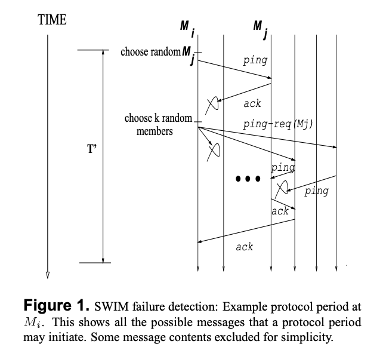

## SWIM: Scalabe Weakly-consistent Infection-style Process Group Membership Protocol 
[](https://travis-ci.org/it-chain/engine) [](https://opensource.org/licenses/Apache-2.0) [](https://golang.org) [](https://coveralls.io/github/DE-labtory/swim?branch=develop)

[SWIM Paper](http://www.cs.cornell.edu/projects/Quicksilver/public_pdfs/SWIM.pdf)

많은 분산 P2P(peer-to-peer) 어플리케이션은 모든 참여하는 Process에 대해 weakly-consistent한 Process 그룹 구성원 정보가 필요하다. SWIM은 대규모 프로세스 그룹에서 그룹 구성원 정보 서비스를 제공하는 범용 소프트웨어 모듈이다. SWIM은 전통적인 heart-beating 프로토콜의 unscalability를 극복하는 것을 목표로 한다. 전통적인 heart-beating protocol과는 다르게,  SWIM은 membership protocol에서 failure detection과 membership 업데이트 기능을 분리하였다.

### Basic SWIM Approach

SWIM은 크게 2개의 컴포넌트로 구성된다.

- A Failure Detector Component: 멤버들의 `failure`를 감지
- Dissemination Component: 최근에 `fail`, ` join`, or `left`한 멤버들의 정보를 전파

#### SWIM Failure Detector

SWIM failure Detector 알고리즘은 2개의 파라미터를 사용한다: `T(protocol period)` 와 `k(the size of failure detection subgroups)`

<p align="center">

</p>

`T` 마다 Failure Detection을 **Figure 1** 같이 수행한다. **Figure 1**은 임의의 노드 `M_i`를 대상으로 Failure Detection 알고리즘을 보여준다.

1. `M_i` 는 `T`시간 마다 membership List에서 랜덤으로 member(`M_j`)를 하나 고르고, `M_j` 에게 `ping`을 보낸다.

2. `M_i`가 ack timeout 시간(`T` 보다 작은 시간) 동안 `M_j`의 `ack`를 기다린다.
   1. `ack` 메세지가 올 경우 종료
   2. `ack` 메세지가 오지 않을 경우 3 수행
3. `M_i`는 mebership List에서 `k`개의 member를 고르고, `ping-req(M_j)`를 보낸다.
4. `ping-req(M_j)`메세지를 받은 노드들은 `M_j`에게 `ping`을 보내고, `ack`를 받으면 `M_i`에게 전달한다.
5. `T` 가 끝날때 쯤, `M_i`는 `M_j`로 부터 혹은 `k`개의 member로 부터 `ack`메세지를 받았는지 확인하고, 메세지가 없을 경우 `M_j`는 fail되었다 판단하여 Dissemination component에게 memberlist update를 요청한다.


ack timeout은 네트워크 안에서의 round-trip을 기반으로 결정한다(평균 혹은 99%를 커버 하도록), `T`는 최소 round-trip보다 3배 이상 이어야 한다(논문에서는 평균 round-trip시간을 timeout으로 설정하였고, `T`는 평균 round-trip시간보다 훨씬 높은 값으로 설정하였다)

각 Message의 data는 unique sequence number를 가지고 있다. `ping`, `ping-req`, `ack` 메세지의 사이즈는 constant며 group의 size와는 관련이 없다.

`M_i`가 `M_j`에게 `k`번의 `ping`을 날리지 않고 indirect하게 `M_i`의 다른 member에게 요청하는 이유는, `M_i`와 `M_j`사이의 네트워크의 혼잡성을 피하기 위함이다.


#### Dissemination Component and Dynamic Membership

Group member(`M_j`)의 fail을 감지하면, 노드(`M_i1`)는 Group의 다른 member에게 `failed(M_j)` 를 multicast한다. `failed(M_j)`를 받은 member들은 local membership List에서 `M_j`를 제거한다.

새로운 노드가 들어오거나 자발적으로 나가게 되면, 해당 정보를 비슷한 방식으로 multicast한다. 그러나 어떤 노드가 Group에 들어오기 위해서는 그룹의 최소한 하나의 member를 알아야 한다. 그 방법은 다음과 같다.

- Group이 well known server와 관련이 있으면, 모든 `join`은 해당 address를 통해 이루어 질 수 있다.
- `Join` 메세지를 broadcast하고 각 group의 member들은 확률적으로 `reply` 한다.
- Group별로`Join`메세지를 전용으로 처리하는 Static coordinator를 둔다.

### A More Robust and Efficient SWIM
일반적인 multicast 방식의 Dissemination은 패킷의 전달을 보장하지 않는 [best-effort](https://en.wikipedia.org/wiki/Best-effort_delivery) 방식이다. 왜냐하면, 패킷의 손실로 group member 간의 상관관계가 없는 임의의 member가 전달될 수 있기 때문이다. 

하지만 SWIM에서는 multicast 방식이 아니라 Infection style을 사용한다. Infection style은 multicast 방식보다 데이터 전파가 많이 되지만, SWIM에서는 failure detection protocol의 membership update 정보를 `ping`, `ping-req`, `ack` 메시지에 같이 넣어서 보내는 [piggyback](https://en.wikipedia.org/wiki/Piggybacking_(data_transmission)) 방식을 사용하여 기존 dissemination에서 발생하는 extra packet을 없앨 수 있게했다. 

SWIM은 이렇게 failure detection과 membership update dissemination component를 분리하여 message overhead를 constant expected 하게 했고 이것은 packet 손실에 있어서 robustness하고 low latency를 제공한다.

#### Infection-style dissemination mechanism

Dissemination Component는 Failure Detector Protocol로부터 `ping`, `ack` 메시지를 받을 때마다 piggyback한다. 이 때 piggyback을 통해서 Dissemination Component는 불필요한 패킷들을 네트워크 내에서 날리지 않는다. SWIM에서 발생하는 패킷은 `ping`, `ping-req`, `ack` 메시지들에 의해서만 발생한다. 그리고 이것을 우리는 infection-style dissemination mechanism이라고 부른다.

##### Implementation Hint

각 그룹의 멤버 `M_i`는 버퍼를 가지고 있는데 

* 버퍼에는 최근에 발생한 membership update 정보들을 담고 있다. 
* 그리고 버퍼에 자신(`M_i`)이 주위 멤버들에게 piggyback한 횟수를 담고 있는 `local count`의 정보를 담는다. 그리고 이 `local count`로 자신이 다음에 누구에게 piggyback 할지를 결정할 수 있다. 
* 버퍼의 사이즈가 한 멤버가 `ping` (또는 `ack`)을 piggyback 할 수 있는 최대 횟수보다 크다면(충분히 크다면) 다음으로 piggyback 할 멤버는 `local count`가 작은 멤버로 한다.  

그리고 두 개의 그룹 멤버 리스트를 가지고 있다.
* 하나에는 아직 그룹에서 “failed” 되지 않은 멤버들을 담고 있고
* 다른 하나에는 현재 “failed” 된 멤버들을 담고 있다.

#### Suspicion mechanism

 만약 프로세스 `M`이 오버헤드가 큰 작업을 하고 있다면, `ping`을 받아도 오버헤드가 큰 작업 때문에 제 시간에 응답할 수 없을 것이다. 그렇다면 그룹 내의 `M`을 제외한 다른 프로세스들은 `ping`에 대한 `M`의 응답을 받지 못했기 때문에 정상 프로세스(non-faulty)를 잘못됨(faulty)으로 처리하고 네트워크에서 제외시킬 수 있다.

  **이렇게 non-faulty 프로세스를 faulty 프로세스로 잘못 처리하는 것을 방지**하기 위해서 SWIM은 Suspicion 메커니즘을 도입했다. Suspicion 메커니즘은 non-faulty 프로세스가 `ping`을 제시간에 응답을 보내지 못하였을 때 바로 네트워크에서 제외시키는 것이 아니라 해당 프로세스를 “suspected”라고 체크하는 것이다. 그리고 해당 프로세스가 “suspected”가 되었다고 Dissemination Component를 통해서 전파한다.

이렇게 “suspected”로 선언된 프로세스가 일정시간이 지나도 `ping`에 대한 응답을 보내지 못했다면 그 때 비로소 “faulty”로 해당 프로세스를 처리하고 네트워크에서 제외시킨다. 그런데 일정시간이 지나기 전에 프로세스가 `ping`에 대한 응답을 준다면 “suspected” 된 프로세스의 상태를 “alive”로 바꾸고 해당 프로세스가 “alive” 되었다는 사실을 네트워크에 전파한다.

##### How Suspicion Protocol Works

Suspicion 프로토콜은 다음과 같이 동작한다. 예를 들어 현재 SWIM failure detector protocol period `T` 시간동안 멤버 `M_i`가 다른 멤버 `M_j`를 `ping` 타겟으로 정하고 보냈다고 생각하자. 이때 `M_i`가 `M_j`에 대한 `ack`를 받지 못해도, `M_i`는 `M_j`를 바로 “failed”라고 선언하지 않는다. 대신 `M_j`를 “Suspected” 멤버라고 로컬 멤버십 리스트에 마크한다. 그리고 

```
{Suspect M_j: M_j suspects M_j}
```

와 같은 형태의 메시지가 Dissemination Component를 통해서 infection-style로 전파된다. 그리고 전파된 메시지를 받은 멤버 `M_i`도 `M_j`를 “Suspected”로 마크한다. 그렇지만 “Suspected” 멤버는 여전히 정상적인(non-faulty) 멤버들과 똑같이 SWIM failure detector protocol에서 `ping` 타겟으로 삼을 수 있다.

protocol period `T`시간동안 `M_i`이 `M_j`에게 `ping`을 보내는데 성공했다면 로컬 멤버십 리스트의 `M_j`에 대한 “Suspected” 마크를 지운다. 그리고 

```
{Alive M_j: M_l knows M_j is alive}
```

와 같은 형태의 메시지를 Dissemination Component를 통해서 전파한다. 그리고 이런 Alive 메시지를 다른 멤버들이 받으면 똑같이 `M_j` 의 “Suspected” 마크를 지운다.

`M_j` 입장에서 다른 멤버로부터 `M_j`를 “Suspected”하고 있다는 메시지를 받으면 `M_j`는 “Alive” 메시지를 다른 멤버들에게 전파할 수 있다.

멤버십 리스트에서 “Suspected” 멤버 리스트는 일정 시간이 지나면 expired된다. 예를 들어 `M_h`가 `M_j`를 “Suspected” 리스트에 가지고 있을 때, 일정 시간이 지날 동안 `M_j`로부터 “Alive” 메시지를 받지 못한다면 `M_h`는 `M_j`를 잘못된(faulty) 멤버라고 생각하고 로컬 멤버십 리스트에서 제외한다. 그리고 `M_j`는 

```
{Confirm M_j: M_h declares M_j as faulty}
```

와 같은 형태의 메시지를 Dissemination Component를 통해서 전파한다. 이와 같은 Suspicion 프로토콜을 통해서 failure detection의 false positives의 비율을 낮출 수 있다.

##### Message Override Rule

위의 예시에서 살펴보면 “Alive” 메시지는 “Suspect” 메시지를 오버라이드할 수 있다. 마찬가지로 “Confirm” 메시지는 “Suspect”메시지와 “Alive” 메시지를 오버라이드 할 수 있다. 그런데 메시지 오버라이드 규칙을 정하기위해서 메시지에 메시지 종류뿐만아니라 `incarnation number`도 추가하여야하는데 이는 멤버의 라이프사이클 동안 여러번 메시지를 받을 수 있기 때문이다. 

첫 번째로 받은 “Alive” 메시지와 두 번째로 받은 “Alive” 메시지를 구분해야 하는데 이를 `incarnation number`을 통해서 하게된다. `incarnation number`는 글로벌하다. 각 멤버 `M_i`의 `incarnation number`은 그룹에 처음 들어오게되면 0으로 초기화된다. 그리고 Dissemination Component로부터 `M_i` 자신이 현재 incarnation에서 “Suspected” 되고 있다면 `M_i`의 `incarnation number`를 증가시키고 “Alive” 메시지를 Dissemination Component를 통해서 그룹에 전파하게된다.

이와 같이 “Suspect”, “Alive”, “Confirm” 메시지는 각 멤버의 `incarnation number`, 멤버의 `id`를 포함하고 있다. 그래서 메시지 별 선호 규칙과 그것이 어떻게 멤버십 리스트에 영향을 미치는지는 다음과 같다.

```
* {Alive Ml, inc=i} overrides
    - {Suspect Ml, inc=j}, i>j
    - {Alive Ml, inc=j}, i>j

* {Suspect Ml, inc=i} overrides
    - {Suspect Ml, inc=j}, i>j
    - {Alive Ml, inc=j}, ij

* {Confirm Ml, inc=i} overrides
    - {Alive Ml, inc=j}, any j
    - {Alive Ml, inc=j}, any j
```

이와 같은 방식으로 각 메시지가 도착했을 때 각 멤버의 상태를 수정한다.

#### Round-Robin Probe Target Selection

**SWIM Failure detector 알고리즘은 그룹 내에서 첫 번째로 문제가 생긴 멤버를 찾아 낼 때 큰 딜레이가 생길 수 있고, 심한 경우에는 문제가 생긴 멤버를 `ping` 타겟으로 삼지 못해 멤버십의 멤버로 찾아내지 못할 수도 있다.** 이러한 문제를 해결하기 위해서 각 멤버 `M_i`는 현재 멤버십에서 알고 있는 멤버들의 리스트를 들고 있고 이 중에서 `ping` 타겟을 랜덤으로 뽑는 것이 아니라 round-robin 방식으로 뽑는다. 전체 리스트를 한 바퀴 다 돌면 `M_i`는 다시 리스트를 랜덤으로 재배열한다.

이런 방식으로 `ping`을 보내게 되면 `M_i`이 가지고 있는 멤버십 리스트를 한바퀴 다 돌 때 모든 멤버들을 한 번씩은 호출하게 된다. 그래서 문제가 생긴 멤버가 생기더라도 그 멤버를 찾는데 걸리는 시간의 worst case를 `M_i`이 가지고 있는 멤버의 수로 한정할 수 있다.


### License

Project source code files are made available under the Apache License, Version 2.0 (Apache-2.0), located in the [LICENSE](LICENSE).

### CLA Hub

To get started, <a href="https://www.clahub.com/agreements/DE-labtory/swim">sign the Contributor License Agreement</a>.
